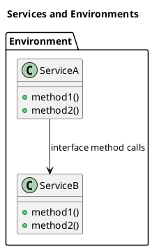
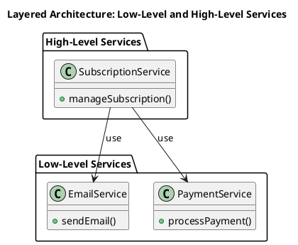
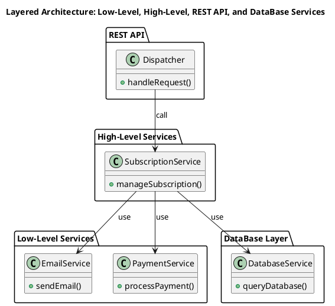
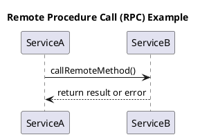
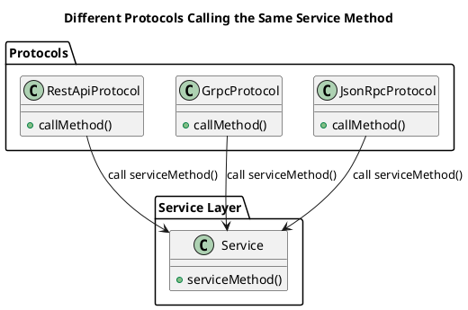

# Architecture

## Services and Environments

A `service` is a module instantiated within an `environment` that implements logic.

In `PHP`, `services` are typically implemented as classes, 
and interactions are organized through public interface methods.

Services usually interact with each other.

An `environment` consists of multiple services instantiated once, 
which interact with each other through interfaces.



There cannot be two copies of the same service within a single environment.

`Services` find each other through `dependency resolution`. 
Thus, when a service is instantiated, it gets its dependency services 
that are in the same `environment` as the service.

This concept allows considering an application as a collection of services interacting with each other. 
The concept of environments provides an additional way to group services.

## Layered Architecture Organization

You can organize a `horizontal` `layered` architecture using environments and services, 
considering a layer as an environment.

For example,
You can separate low-level services from services that implement business logic, 
as shown in the diagram:



In this example, the `Low-Level Services` environment contains services that implement low-level logic,
such as sending emails and processing payments.
The `High-Level Services` environment contains services that implement business logic, 
such as managing subscriptions.

This code organization is useful because services from a dependent environment 
cannot be linked to a high-level environment without "hacks." 
Additionally, explicit grouping of services helps developers see which service belongs to which layer.

Now we can consider the overall architecture of the application in the following diagram:



In this diagram, the `REST API` environment contains services that handle incoming requests.
The `High-Level Services` environment contains services that implement business logic.
The `Low-Level Services` environment contains services that implement low-level logic.
The `DataBase Layer` environment contains services that interact with the database.

## Principle of Minimal Dependency for the Business Logic Layer

`Clean architecture` advocates for the principle of minimizing the dependency of the business logic layer on other components. 
Ideally, the business logic layer should not depend on anything at all. 
We can adhere to this principle by using dependency inversion and grouping services.

In practice, this means we should strive for the following principles:

1. Business-level code should be a single entry point, 
without additional adapters, helper classes/components.
2. Business-level code should not depend on the API layer.

To achieve this, we will consider services, 
their interfaces, and methods as a universal `RPC model`, 
where interactions with services can be viewed as remote procedure calls.

## RPC Model

An abstract RPC model consists of services and procedures that can be called remotely.



In this model, `ServiceA` calls a method on `ServiceB` and receives a result or error.

To perform a remote procedure call, the following knowledge is required:

1. You need to know which service contains the method.
2. You need to know the information about what parameters can be passed 
to the remote procedure and in what format.

Imagine that we can have multiple implementations of parameter transmission protocols, 
different types of parameter encoding, 
and various ways of delivering results. 
In this case, we can describe interactions with services as interactions between 
different protocols, which differ in implementation details but provide the same way of calling the same procedure.



## Principle of Unified (single source) Description

To achieve the goals described above, 
we must enable the description of RPC interactions in such a way 
that information about data formats and encoding methods can be extracted from a single source. 
Since a service method is a regular class method, 
this means that a regular PHP class method should become 
the single source of description for a remote RPC call.

This means that the definition of a service method 
should include information about data types that correspond to business logic rather than the programming language level. 
For example:

```php
class Service {
    public function serviceMethod(string $uuid, int $timestamp): bool
    {
        // method implementation
    }
}
```

The method below contains a parameter of type UUID, 
which is passed as a string. 
If we write the method in this way, the information about the data type will be lost.

Therefore, we must use **SPECIFIC** data types that reflect the business logic rules:

```php
class Service {
    public function serviceMethod(Uuid $uuid, Timestamp $timestamp): bool
    {
        // method implementation
    }
}
```

In this case, the `Uuid` and `Timestamp` classes are specific classes that reflect the business logic rules.

